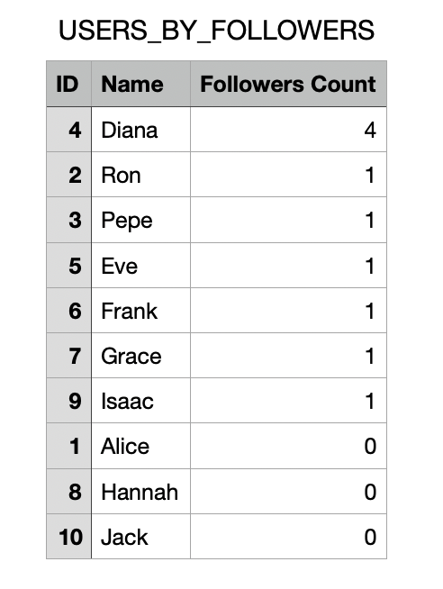

# SocialMeli (be_java_hisp_w28_g10)

This is a project corresponding to the Sprint 1 of the JAVA bootcamp for Mercado Libre, wave 28.

Mercado Libre continues to grow and for the new year has the objective of beginning with the implementation of a series of tools that allow the buyers and sellers to have an innovative experience, making their relationship grow.
The Beta version will be known as SocialMeli. Here the buyers will be able to follow their favourite sellers and find out first about all the news related to them.


## Tech Stack

**Backend:** JAVA 21 - JDK 21 - Spring Boot 21 - Maven 


## Run Locally

Clone the project

```bash
  git clone https://github.com/GuilleKalniker/be_java_hisp_w28_g10
```

Go to the project directory

```bash
  cd be_java_hisp_w28_g10
```

Install maven

```bash
  Install mvn https://maven.apache.org/install.html
```

or

```bash
  brew install maven
```

Run in console

```bash
  mvn spring-boot:run
```

## Generate Documentation

```bash
  mvn javadoc:javadoc
```

## API Reference

#### Follow a user

```http
  POST /users/{userId}/follow/{userIdToFollow}
```

| Parameter        | Type  | Description                                                  |
|:-----------------|:------|:-------------------------------------------------------------|
| `userId`         | `int` | **Required**. Number that identifies the current user        |
| `userIdToFollow` | `int` | **Required**. Number that identifies the user to be followed |

#### Get amount of followers for user

```http
  GET /users/{userId}/followers/count
```

| Parameter | Type  | Description                                        |
|:----------|:------|:---------------------------------------------------|
| `userId`  | `int` | **Required**. Number that identifies the each user |

#### Get list of followers for user

```http
  GET /users/{userId}/followers/list
    /users/{UserID}/followers/list?order=name_asc
    /users/{UserID}/followers/list?order=name_desc
```

| Parameter   | Type     | Description                                        |
|:------------|:---------|:---------------------------------------------------|
| `userId`    | `int`    | **Required**. Number that identifies the each user |
| `name_asc`  | `String` | **Optional**. Ascending alphabetical order         |
| `name_desc` | `String` | **Optional**. Descending alphabetical order        |

#### Get list of users followed by an user

```http
  GET /users/{userId}/followed/list
    /users/{UserID}/followed/list?order=name_asc
    /users/{UserID}/followed/list?order=name_desc
```

| Parameter   | Type     | Description                                        |
|:------------|:---------|:---------------------------------------------------|
| `userId`    | `int`    | **Required**. Number that identifies the each user |
| `name_asc`  | `String` | **Optional**. Ascending alphabetical order         |
| `name_desc` | `String` | **Optional**. Descending alphabetical order        |

#### Post new post

```http
  POST /products/post
```

| Parameter      | Type        | Description                                                                         |
|:---------------|:------------|:------------------------------------------------------------------------------------|
| `user_id`      | `int`       | **Required**. Number that identifies the each user                                  |
| `date`         | `LocalDate` | **Required** Date of the post in format dd-MM-yyyy                                  |
| `product_id`   | `int`       | **Required** Identity number of a product associated to a publication               |
| `product_name` | `String`    | **Required** String of characters that represents the name of a product             |
| `type`         | `String`    | **Required** String of characters that represents the type of a product             |
| `brand`        | `String`    | **Required** String of characters that represents the brand of a product            |
| `color`        | `String`    | **Required** String of characters representing the color of a product               |
| `notes`        | `String`    | **Required** String of characters for placing notes or observations about a product |
| `category`     | `int`       | **Required** Identifier used to determine the category a product belongs to         |
| `price`        | `double`    | **Required** Price of the product                                                   |

#### Get all posts from the sellers a user follows from the last two weeks

```http
  GET /products/followed/{userId}/list
    /products/followed/{userId}/list?order=date_asc
    /products/followed/{userId}/list?order=date_desc
```

| Parameter   | Type     | Description                                        |
|:------------|:---------|:---------------------------------------------------|
| `user_id`   | `int`    | **Required**. Number that identifies the each user |
| `date_asc`  | `String` | **Optional**. Ascending date order                 |
| `date_desc` | `String` | **Optional**. Descending date order                |

#### Unfollow a user by another user

```http
  POST /users/{userId}/unfollow/{userIdToUnfollow}
```

| Parameter        | Type   | Description                                                  |
|:-----------------|:-------|:--------------- ----------------------------------------------|
| `userId`         | `int`  | **Required**. Number that identifies the current user        |
| `userIdToFollow` | `int`  | **Required**. Number that identifies the user to be followed |

#### Post new post with promotion

```http
  POST /products/promo-post
```

| Parameter      | Type        | Description                                                                         |
|:---------------|:------------|:------------------------------------------------------------------------------------|
| `user_id`      | `int`       | **Required**. Number that identifies the each user                                  |
| `date`         | `LocalDate` | **Required** Date of the post in format dd-MM-yyyy                                  |
| `product_id`   | `int`       | **Required** Identity number of a product associated to a publication               |
| `product_name` | `String`    | **Required** String of characters that represents the name of a product             |
| `type`         | `String`    | **Required** String of characters that represents the type of a product             |
| `brand`        | `String`    | **Required** String of characters that represents the brand of a product            |
| `color`        | `String`    | **Required** String of characters representing the color of a product               |
| `notes`        | `String`    | **Required** String of characters for placing notes or observations about a product |
| `category`     | `int`       | **Required** Identifier used to determine the category a product belongs to         |
| `price`        | `double`    | **Required** Price of the product                                                   |
| `has_promo`    | `boolean`   | **Required** True or false to determine if a product is in promotion or not         |
| `discount`     | `double`    | **Required** Stablishes the discount amount                                         |

#### Get the amount of posts with promotion from an user

```http
  GET /products/promo-post/count?user_id={userId}
```

| Parameter | Type  | Description                                        |
|:----------|:------|:---------------------------------------------------|
| `user_id` | `int` | **Required**. Number that identifies the each user |

#### Get the amount of posts with promotion from an user

```http
  GET /reports/getReport/{report_name}?order={order}&top={int}
  
  /reports/getReport/USERS_BY_FOLLOWERS?order=count_asc&top={int}
  /reports/getReport/USERS_BY_FOLLOWERS?order=count_desc&top={int}
  
  /reports/getReport/USERS_BY_FOLLOWS?order=count_asc&top={int}
  /reports/getReport/USERS_BY_FOLLOWS?order=count_desc&top={int}
  
  /reports/getReport/USERS_BY_POSTS?order=count_asc&top={int}
  /reports/getReport/USERS_BY_POSTS?order=count_desc&top={int}
  
  /reports/getReport/POSTS_BY_PRICE?order=price_asc&top={int}
  /reports/getReport/POSTS_BY_PRICE?order=price_desc&top={int}
  
  /reports/getReport/POSTS_BY_DISCOUNT?order=discount_asc&top={int}
  /reports/getReport/POSTS_BY_DISCOUNT?order=discount_desc&top={int}
  
  /reports/getReport/POSTS_BY_DATE?order=date_asc&top={int}
  /reports/getReport/POSTS_BY_DATE?order=date_desc&top={int}
```

| Parameter            | Type     | Description                                                                                                                         |
|:---------------------|:---------|:------------------------------------------------------------------------------------------------------------------------------------|
| `report_name`        | `String` | **Required**. Report name: [USERS_BY_FOLLOWERS, USERS_BY_FOLLOWS, USERS_BY_POSTS, POSTS_BY_PRICE, POSTS_BY_DISCOUNT, POSTS_BY_DATE] |
| `USERS_BY_FOLLOWERS` | `String` | Report name: users by how many followers the have                                                                                   |
| `USERS_BY_FOLLOWS`   | `String` | Report name: users by how many they follow                                                                                          |
| `USERS_BY_POSTS`     | `String` | Report name: users by how many posts they have                                                                                      |
| `POSTS_BY_PRICE`     | `String` | Report name: post by their price                                                                                                    |
| `POSTS_BY_DISCOUNT`  | `String` | Report name: posts by their discount                                                                                                |
| `POSTS_BY_DATE`      | `String` | Report name: posts by their date                                                                                                    |
| `count_asc`          | `String` | **Option**. Ascending amount for reports USERS_BY_FOLLOWERS, USERS_BY_FOLLOWS, USERS_BY_POSTS                                       |
| `count_desc`         | `String` | **Option**. Descending amount for reports USERS_BY_FOLLOWERS, USERS_BY_FOLLOWS, USERS_BY_POSTS                                      |
| `price_asc`          | `String` | **Option**. Ascending price for report POSTS_BY_PRICE                                                                               |
| `price_desc`         | `String` | **Option**. Descending price for report POSTS_BY_PRICE                                                                              |
| `discount_asc`       | `String` | **Option**. Ascending price for report POSTS_BY_DISCOUNT                                                                            |
| `discount_desc`      | `String` | **Option**. Descending price for report POSTS_BY_DISCOUNT                                                                           |
| `date_asc`           | `String` | **Option**. Ascending price for report POSTS_BY_DATE                                                                                |
| `date_desc`          | `String` | **Option**. Descending price for report POSTS_BY_DATE                                                                               |
| `top`                | `int`    | **Required**. Number of results expected                                                                                            |

- Response: .csv file (must be executed from browser)


- Example: USERS_BY_FOLLOWERS report in descending order csv file



## Naming rules
#### Branch name:
- feature/{nro}
  **Example** feature/SCRUM-15
#### Commits
- Format [ tk | type | description ]
- Types : [ US | FIX | FORMAT | DOCS]
  **Example** SCRUM-3 US-0001 make a follow
#### Language
-  English
#### Naming
- General -> camelCase
- DTO Mapping -> snake_case

## Documentation

- Flow chart


- Class Diagram


[Postman Library](/src/main/resources/SocialMeli.postman_collection.json)

## Authors

- [Guillermo Kalniker](https://www.github.com/GuilleKalniker)
- [Astrid Malamud](https://www.github.com/astrid21)
- [Fermin Gonzalez](https://www.github.com/Siomermin)
- [William Nicolas Buitrago Camacho](https://www.github.com/wnicolas)
- [Eliseo David Pets Aliberto](https://www.github.com/david-aliberto)
- [David Santiago Parrado Sanchez](https://www.github.com/santiagoparrado)
