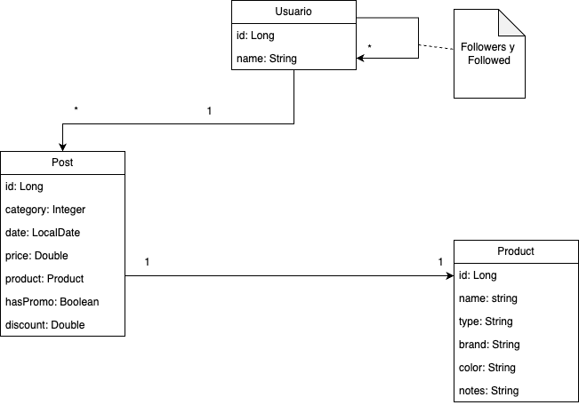

# SocialMeli API - GRUPO 5

## Integrantes
- Francisco Caloia
- Juan Ignacio Abarca Vecchio
- Mauricio Ballesteros Rodriguez
- Nicolas Eduardo Pardo Arias
- Zully Yineth Tamayo Martinez
- Tomás Peiretti (Tech lead)

## Definicion del problema
Mercado Libre sigue creciendo, por lo cual es necesaria la presentación de una versión Beta de lo que va a ser conocido como “SocialMeli”, en donde los compradores van a poder seguir a sus vendedores favoritos y enterarse de todas las novedades que los mismos posteen.

## Cómo utilizar el API

### Ejecutar el proyecto
1. Abrir el proyecto con IntelliJ
2. Habilitar lombok en la configuración del proyecto
3. Ejecutar el proyecto.
> Por defecto, el servidor se ejecutará en el puerto 8080

### Test de los endpoints
> https://documenter.getpostman.com/view/40207081/2sAYJ1jgi3

> La colección de datos de POSTMAN se encuentra en `./src/main/resources/socialmeli.postman_collection.json`

Antes de ejecutar los endpoints deseados, se deben cargar los datos de prueba con las request que se encuentran bajo la colección "Init data" (respetando el orden):
1. CREATE USERS
2. CREATE POSTS & PRODUCTS
3. FOLLOW USERS 1
4. FOLLOW USERS 2 
5. FOLLOW USERS 3 

## Implementación del API

### Diagrama de clases

Como parte fundamental en el proceso de desarrollo de software, el diseño previo a la implementación permite estructurar y organizar de manera eficiente los componentes del sistema. A continuación, se presenta el diagrama de clases que refleja la estructura y funcionalidad del sistema propuesto.

### Asignacion de historias de usuario

Se definieron dos (2) reviewers por PR:

|     Dev Reviewers    |
|:--------------------:|
| Tomas Peiretti       |
| Juan Abarca          |
| Mauricio Ballesteros |
| Francisco Caloia     |
| Nicolas P. Arias     |

#### US por desarrollador

| US code      | Developer |
|:-------------|:----------|
| `us_0001`    | Francisco |
| `us_0002`    | Zully     |
| `us_0003`    | Mauricio  |
| `us_0004`    | Nicolas   |
| `us_0005`    | Juan      |
| `us_0006`    | Francisco |
| `us_0007`    | Zully     |
| `us_0008`    | Mauricio  |
| `us_0009`    | Nicolas   |
| `us_0010`    | Mauricio  |
| `us_0011`    | Zully     |
| `us_0012`    | Juan      |
| `us_0013`    | Francisco |
| `us_0014`    | Mauricio  |

> Para mayor informacion y revision de los requirimientos tecnicos de las US, referir la [documentación técnica](./docs/doc-tecnica.pdf)

**Preparacion de Arquitectura**: Francisco Caloia

**Creación de endpoints para datos iniciales (dummy data)**: Tomás Peiretti 

**QA Testing (Postman)**: Juan Abarca y Tomás Peiretti

**README**: Nicolas P. Arias

### Endpoints BONUS
Las historias de usuario US 0012, 0013 y 0014 corresponden a endpoints bonus (extra).

- **US 0012**: Poder obtener el usuario con la mayor cantidad de seguidores
- **US 0013**: Poder consultar los post de una categoría determinada
- **US 0014**: Poder eliminar todas las publicaciones realizadas por un usuario

La especificación de éstos puede encontrarse al final de la [documentación técnica](./docs/doc-tecnica.pdf)