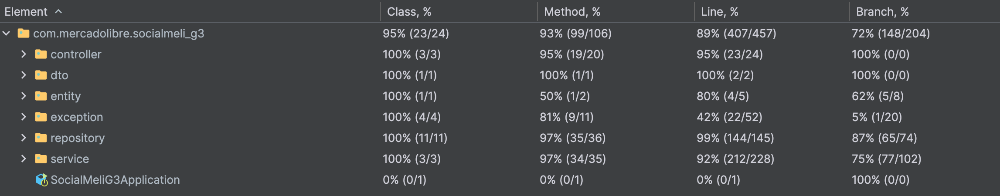

# Sprint I y II - Java Spring Boot

## 🎯 Objetivo

Desarrollar una API para un escenario determinado de manera grupal. En el la siguiente sección se encuentra una
descripción detallada del escenario y cada uno de los requerimientos solicitados.

## 📍Escenario y requerimientos iniciales

### Sprint I

Mercado Libre sigue creciendo y para el año que viene tiene como objetivo empezar a implementar una serie de
herramientas que permitan a los compradores y vendedores tener una experiencia totalmente innovadora, en donde el lazo
que los una sea mucho más cercano.

La fecha de lanzamiento se aproxima, por lo cual es necesaria la presentación de una versión Beta de lo que va a ser
conocido como “SocialMeli”, en donde los compradores van a poder seguir a sus vendedores favoritos y enterarse de todas
las novedades que los mismos posteen.

### Sprint II

SocialMeli, la nueva implementación de MercadoLibre que fue realizada por el equipo de desarrollo “Bootcamp” se ha
convertido en ¡Todo un éxito!. Dado esto y a que MeLi tiene unos estándares de calidad muy altos con respecto a los
productos de software que utiliza, estableció una serie de validaciones que considera que sean necesarias tener en
cuenta a la hora de incorporar datos como así también diferentes test unitarios que aseguren el correcto funcionamiento
de cada una de las funcionalidades que incluye.

Para llevar a cabo estas implementaciones, se deberá tomar como base el proyecto desarrollado de forma grupal en el
Sprint Nº 1. A partir de él, se llevarán a cabo cada una de las validaciones y tests unitarios correspondientes.

# 🤓☝🏻 Definiciones de equipo

* **Clonar el repositorio**

````
git clone https://github.com/InakiEtc/be_java_hisp_w28_g03.git
````

* **Abrir el IDE IntelliJ y ejecutar el programa**

*Nota: En caso de presentar problemas con la libreria de Lombok, seguir las siguienetes recomendaciones:*

```
-> Entrar a los Settings
-> Build, Excecution, Deployment
-> Compiler
-> Annotation Processors
-> Seleccionar el proyecto
-> Seleccionar la opción "Obtein processors from project classpath
-> "Apply"
```

# 📋 Tablero de documentación y seguimiento

A continuación pueden acceder a nuestro tablero donde se presentan los tickets asignados así como la documentación.

[Tablero de GitHub con los tickets](https://github.com/users/InakiEtc/projects/1).

[Documentación completa de los endpoints en PDF](src/main/resources/DocumentacionEndpoints.pdf) (Está ubicada en la
carpeta "resources")

# 🏄🏻‍♂️ Pruebas (Postman)

Una vez ejecutado el programa en el el IDE de IntelliJ, descargar de la carpeta *Resources* la colección de endpoints.
Esta colección tiene las rutas y su respectivo número de US.

# 🤝🏻 Acuerdos del equipo

El equipo de desarrollo ha definido las siguientes reglas y estándares con el objetivo de mantener una estructura
ordenada, evitar inconsistencias y facilitar la colaboración.

### 1️⃣ Creación de Posts

- **Productos preexistentes**:  
  Antes de crear un nuevo post, se debe asegurar de que los productos estén previamente creados en el sistema. Esto
  evita la duplicación y asegura la consistencia de los datos.

### 2️⃣ Estándares de Codificación y adecuaciones de tipos de datos

- **Uso de Camel Case**:  
  Todos los identificadores (variables, funciones, etc.) deben seguir el estándar de camel case. Ejemplos:
    - `productList`
    - `getProductDetails`

> [!NOTE]
> Para las clases e interfaces, se debe usar UpperCamelCase. Ejemplo: ```java public class Product { ... }```

- **Inyección de Dependencia con Constructores**:  
  Se debe implementar inyección de dependencias a través de constructores para garantizar un código más flexible,
  modular y fácilmente testeable.

- **Adecuación de tipos de datos**:
  Se decidio el uso de Wrappers para todos los tipos de datos con el objetivo de poder utilizar las validaciones de
  Spring Boot Starter Test en los DTOs. Esto se hizo debido a que los atributos con tipo primitivo no pueden ser de tipo
  null.

### 3️⃣ Carga de Datos

- **Data recargada con JSON**:  
  Todos los datos iniciales y mock se deben cargar a través de archivos JSON. Esto permite mayor claridad en la
  estructura de los datos y facilita su reutilización durante el desarrollo.

### 4️⃣ Control de Versiones

- **Rama por persona**:  
  Cada miembro del equipo debe trabajar en una rama específica asociada a su nombre. Esto minimiza conflictos y mantiene
  el control sobre los cambios.
  Ejemplo:
    - `/baron_santiago`
    - `/bianchi_juan`

      <br>

- **Commit Convention**:  
  Las descripciones de los commits deben seguir una convención predefinida. Esto ayuda a comprender rápidamente el
  propósito de cada cambio. Ejemplo de prefijos:
    - `feat`: Para agregar nuevas funcionalidades.
    - `fix`: Para solucionar errores.
    - `docs`: Para cambios en documentación.
    - `style`: Para ajustes relacionados con formato o estilo del código.
    - `test`: Para agregar o modificarlos test unitarios y de integración.

### 5️⃣ Idioma

- **Uso del Inglés**:  
  Todo el código, nombres de variables, funciones, comentarios y documentación técnica deben estar en inglés. Esto
  asegura un estándar profesional y facilita la colaboración con equipos internacionales.

### 6️⃣ Tests unitarios y de integración

- **Tests unitarios y de integración**:
  El formato de nombre para los tests unitarios debe ser `T-0001` donde `0001` es el número del test. Y para el nombre
  de los test de integración debe ser `IT-0001` donde `0001` es el número de la historia de usuario.
- **Nombre de las funciones de los tests unitarios y de integración**:
  El formato de nombre para las funciones de los tests unitarios y de integración debe ser
  `test_<nombre de la función>_should_<lo que debe retornar>_when<cuando suceda algo>`.

## 💻 Tecnologías usadas

    1. Java 21
    2. Spring Boot
    3. Spring Boot Devtools
    4. Lombok
    5. Spring Boot Starter Test
    6. Mockito

## 🏃🏻‍➡️ Integrantes del equipo

| Integrante       |      País      |
|------------------|:--------------:|
| Lucas Bianchi    | Argentina 🇦🇷 |
| Santiago Baron   | Colombia 🇨🇴  |
| Juan Bianchi     | Argentina 🇦🇷 |
| Gabriel Viloria  | Colombia  🇨🇴 |
| Julieta Noguera  | Argentina 🇦🇷 |
| Iñaki Etchegoyen | Argentina 🇦🇷 |

## 🧲 Responsabilidades asignadas

| Código | Historia de usuario                                                               |   Responsable    |    Revisores    |
|--------|:----------------------------------------------------------------------------------|:----------------:|:---------------:|
| US001  | Dar follow a un determinado vendedor                                              |   Juan Bianchi   | Julieta Noguera |
| US002  | Cantidad de usuarios que siguen a un determinado vendedor                         | Julieta Noguera  | Gabriel Viloria |
| US003  | Obtener listado de usuarios que siguen a determinado vendedor                     |  Santiago Baron  |  Juan Bianchi   |
| US004  | Listado de todos los vendedores a los cuales sigue un determinado usuario         |  Lucas Bianchi   |  Iñaki Martin   |
| US005  | Dar de alta una nueva publicación                                                 | Iñaki Etchegoyen |  Lucas Bianchi  |
| US006  | Listar publicaciones recientes de vendedores seguidos en las ultimas 2 semanas    | Gabriel Viloria  | Santiago Baron  |
| US007  | Poder realizar la acción de “Unfollow” a determino usuario                        |  Santiago Baron  |  Juan Bianchi   |
| US008  | Ordenamiento alfabético ascendente y descendente                                  | Julieta Noguera  |  Juan Bianchi   |
| US009  | Ordenamiento por fecha ascendente y descendente                                   |   Juan Bianchi   | Gabriel Viloria |
| US0010 | Llevar a cabo la publicación de un nuevo producto en promoción                    | Iñaki Etchegoyen | Julieta Noguera |
| US0011 | Obtener la cantidad de productos en promoción de un determinado vendedor          | Gabriel Viloria  | Santiago Baron  |
| US0012 | Obtener un listado de todos los productos en promoción de un determinado vendedor |  Lucas Bianchi   | Santiago Baron  |

**🎖️ Bonus (1 bonus por integrante adicional)**

| Código | Historia de usuario                               |   Responsable    |    Revisores     
|--------|:--------------------------------------------------|:----------------:|:----------------:|
| US0013 | Convertir un Post en un PromoPost                 | Iñaki Etchegoyen | Julieta Noguera  |
| US0014 | Filtrar productos por palabra clave               |  Santiago Baron  |  Lucas Bianchi   |
| US0015 | Filtrar productos por rango rango de precio       | Gabriel Viloria  |  Lucas Bianchi   |
| US0016 | Filtrar post por rango categoria                  | Julieta Noguera  | Iñaki Etchegoyen |
| US0017 | Filtrar post por distintos atributos de productos |   Juan Bianchi   | Gabriel Viloria  |
| US0018 | Seguidores por nombre de usuario                  |  Lucas Bianchi   | Gabriel Viloria  |

# Test unitarios y de integración

# 🚀 Coverage alcanzado


## 🧩 Test unitarios

A continuación se presentan los test unitarios que se han realizado para la aplicación.

| Código | Historia de usuario                                                                                                                                                  |   Responsable    |    Revisores     
|--------|:---------------------------------------------------------------------------------------------------------------------------------------------------------------------|:----------------:|:----------------:|
| T-0001 | Verificar que el usuario a seguir exista. (US-0001)                                                                                                                  | Julieta Noguera  | Iñaki Etchegoyen |
| T-0002 | Verificar que el usuario a dejar de seguir exista. (US-0007)                                                                                                         | Iñaki Etchegoyen |   Juan Bianchi   |
| T-0003 | Verificar que el tipo de ordenamiento alfabético exista (US-0008)                                                                                                    |   Juan Bianchi   | Iñaki Etchegoyen |
| T-0004 | Verificar el correcto ordenamiento ascendente y descendente por nombre. (US-0008)                                                                                    |   Juan Bianchi   | Iñaki Etchegoyen |
| T-0005 | Verificar que el tipo de ordenamiento por fecha exista (US-0009)                                                                                                                    |  Lucas Bianchi   | Gabriel Viloria  |
| T-0006 | Verificar el correcto ordenamiento ascendente y descendente por fecha. (US-0009)                                                                                                                                     |  Lucas Bianchi   | Gabriel Viloria  |
| T-0007 | Verificar que la cantidad de seguidores de un determinado usuario sea correcta. (US-0002)                                                                                       |  Santiago Baron  |   Juan Bianchi   |
| T-0008 | Verificar que la consulta de publicaciones realizadas en las últimas dos semanas de un determinado vendedor sean efectivamente de las últimas dos semanas. (US-0006)            | Gabriel Viloria  |   Juan Bianchi   |

## ⚙️ Test de integración

A continuación se presentan los test de integración que se han realizado para la aplicación.

| Código  | Historia de usuario                                                               |   Responsable    |    Revisores     |
|---------|:----------------------------------------------------------------------------------|:----------------:|:----------------:|
| IT-0001 | Dar follow a un determinado vendedor                                              |   Juan Bianchi   | Gabriel Viloria  |
| IT-0002 | Cantidad de usuarios que siguen a un determinado vendedor                         | Julieta Noguera  | Gabriel Viloria  |
| IT-0003 | Obtener listado de usuarios que siguen a determinado vendedor                     |  Santiago Baron  | Gabriel Viloria  |
| IT-0004 | Listado de todos los vendedores a los cuales sigue un determinado usuario         |  Lucas Bianchi   |  Santiago Baron  |
| IT-0005 | Dar de alta una nueva publicación                                                 | Iñaki Etchegoyen |   Juan Bianchi   |
| IT-0006 | Listar publicaciones recientes de vendedores seguidos en las ultimas 2 semanas    | Gabriel Viloria  |  Santiago Baron  |
| IT-0007 | Poder realizar la acción de “Unfollow” a determino usuario                        |  Santiago Baron  | Iñaki Etchegoyen |
| IT-0008 | Ordenamiento alfabético ascendente y descendente                                  | Julieta Noguera  | Gabriel Viloria  |
| IT-0009 | Ordenamiento por fecha ascendente y descendente                                   |   Juan Bianchi   | Iñaki Etchegoyen |
| IT-0010 | Llevar a cabo la publicación de un nuevo producto en promoción                    | Iñaki Etchegoyen |  Santiago Baron  |
| IT-0011 | Obtener la cantidad de productos en promoción de un determinado vendedor          | Gabriel Viloria  |  Lucas Bianchi   |
| IT-0012 | Obtener un listado de todos los productos en promoción de un determinado vendedor |  Lucas Bianchi   |  Santiago Baron  |

## 🍄 Bonus integración y unitarios

A continuación se presentan los test de integración y unitarios que se han realizado para la aplicación a modo de bonus.

| Código        | Historia de usuario                                         |   Responsable    |    Revisores     |
|---------------|:------------------------------------------------------------|:----------------:|:----------------:|
| BONUS IT-0013 | Convertir un post normal en un promo Post                   | Iñaki Etchegoyen | Julieta Noguera  |
| BONUS IT-0014 | Filtrar producto por palabra clave                          |  Santiago Baron  | Iñaki Etchegoyen |
| BONUS IT-0015 | Filtrar productos por rango de precio                       | Gabriel Viloria  |  Santiago Baron  |
| BONUS IT-0016 | Filtrar los post por categoria                              | Julieta Noguera  |   Juan Bianchi   |
| BONUS IT-0017 | Verificar el filtro en los productos                        |   Juan Bianchi   |  Santiago Baron  |
| BONUS IT-0018 | Filtrar por followers de un usuario con condición de nombre |  Lucas Bianchi   |  Santiago Baron  |

# 🌅 Agradecimientos

Un especial agradecimiento a nuestros instructores por su guía durante todo el proceso, así como a nuestros compañeros
por llenarnos de conocimiento durante el corto tiempo que hemos compartido.


