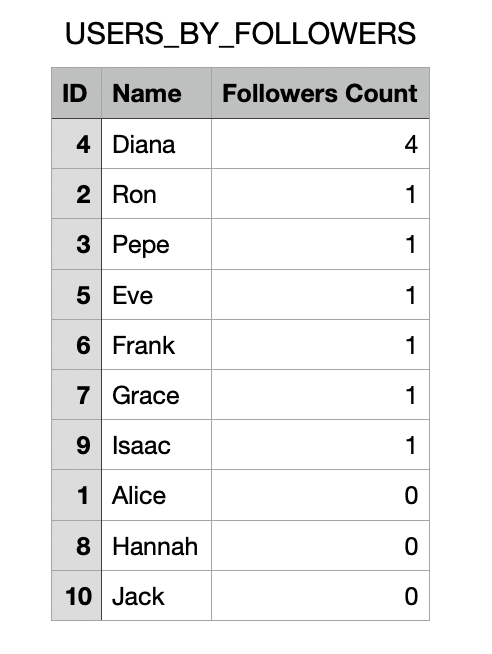

# SocialMeli (be_java_hisp_w28_g10)

This is a project corresponding to the Sprint 1 of the JAVA bootcamp for Mercado Libre, wave 28.

Mercado Libre continues to grow and for the new year has the objective of beginning with the implementation of a series of tools that allow the buyers and sellers to have an innovative experience, making their relationship grow.
The Beta version will be known as SocialMeli. Here the buyers will be able to follow their favourite sellers and find out first about all the news related to them.


## Tech Stack

**Backend:** JAVA 21 - JDK 21 - Spring Boot 21 - Maven 


## Run Locally

Clone the project

```bash
  git clone https://github.com/GuilleKalniker/be_java_hisp_w28_g10
```

Go to the project directory

```bash
  cd be_java_hisp_w28_g10
```

Install maven

```bash
  Install mvn https://maven.apache.org/install.html
```

or

```bash
  brew install maven
```

Run in console

```bash
  mvn spring-boot:run
```

## Generate Documentation

```bash
  mvn javadoc:javadoc
```

## API Reference

#### Follow a user

```http
  POST /users/{userId}/follow/{userIdToFollow}
```

| Parameter        | Type  | Description                                                  |
|:-----------------|:------|:-------------------------------------------------------------|
| `userId`         | `int` | **Required**. Number that identifies the current user        |
| `userIdToFollow` | `int` | **Required**. Number that identifies the user to be followed |

#### Get amount of followers for user

```http
  GET /users/{userId}/followers/count
```

| Parameter | Type  | Description                                        |
|:----------|:------|:---------------------------------------------------|
| `userId`  | `int` | **Required**. Number that identifies the each user |

#### Get list of followers for user

```http
  GET /users/{userId}/followers/list
    /users/{UserID}/followers/list?order=name_asc
    /users/{UserID}/followers/list?order=name_desc
```

| Parameter   | Type     | Description                                        |
|:------------|:---------|:---------------------------------------------------|
| `userId`    | `int`    | **Required**. Number that identifies the each user |
| `name_asc`  | `String` | **Optional**. Ascending alphabetical order         |
| `name_desc` | `String` | **Optional**. Descending alphabetical order        |

#### Get list of users followed by an user

```http
  GET /users/{userId}/followed/list
    /users/{UserID}/followed/list?order=name_asc
    /users/{UserID}/followed/list?order=name_desc
```

| Parameter   | Type     | Description                                        |
|:------------|:---------|:---------------------------------------------------|
| `userId`    | `int`    | **Required**. Number that identifies the each user |
| `name_asc`  | `String` | **Optional**. Ascending alphabetical order         |
| `name_desc` | `String` | **Optional**. Descending alphabetical order        |

#### Post new post

```http
  POST /products/post
```

| Parameter      | Type        | Description                                                                         |
|:---------------|:------------|:------------------------------------------------------------------------------------|
| `user_id`      | `int`       | **Required**. Number that identifies the each user                                  |
| `date`         | `LocalDate` | **Required** Date of the post in format dd-MM-yyyy                                  |
| `product_id`   | `int`       | **Required** Identity number of a product associated to a publication               |
| `product_name` | `String`    | **Required** String of characters that represents the name of a product             |
| `type`         | `String`    | **Required** String of characters that represents the type of a product             |
| `brand`        | `String`    | **Required** String of characters that represents the brand of a product            |
| `color`        | `String`    | **Required** String of characters representing the color of a product               |
| `notes`        | `String`    | **Required** String of characters for placing notes or observations about a product |
| `category`     | `int`       | **Required** Identifier used to determine the category a product belongs to         |
| `price`        | `double`    | **Required** Price of the product                                                   |

#### Get all posts from the sellers a user follows from the last two weeks

```http
  GET /products/followed/{userId}/list
    /products/followed/{userId}/list?order=date_asc
    /products/followed/{userId}/list?order=date_desc
```

| Parameter   | Type     | Description                                        |
|:------------|:---------|:---------------------------------------------------|
| `user_id`   | `int`    | **Required**. Number that identifies the each user |
| `date_asc`  | `String` | **Optional**. Ascending date order                 |
| `date_desc` | `String` | **Optional**. Descending date order                |

#### Unfollow a user by another user

```http
  POST /users/{userId}/unfollow/{userIdToUnfollow}
```

| Parameter        | Type   | Description                                                  |
|:-----------------|:-------|:--------------- ----------------------------------------------|
| `userId`         | `int`  | **Required**. Number that identifies the current user        |
| `userIdToFollow` | `int`  | **Required**. Number that identifies the user to be followed |

#### Post new post with promotion

```http
  POST /products/promo-post
```

| Parameter      | Type        | Description                                                                         |
|:---------------|:------------|:------------------------------------------------------------------------------------|
| `user_id`      | `int`       | **Required**. Number that identifies the each user                                  |
| `date`         | `LocalDate` | **Required** Date of the post in format dd-MM-yyyy                                  |
| `product_id`   | `int`       | **Required** Identity number of a product associated to a publication               |
| `product_name` | `String`    | **Required** String of characters that represents the name of a product             |
| `type`         | `String`    | **Required** String of characters that represents the type of a product             |
| `brand`        | `String`    | **Required** String of characters that represents the brand of a product            |
| `color`        | `String`    | **Required** String of characters representing the color of a product               |
| `notes`        | `String`    | **Required** String of characters for placing notes or observations about a product |
| `category`     | `int`       | **Required** Identifier used to determine the category a product belongs to         |
| `price`        | `double`    | **Required** Price of the product                                                   |
| `has_promo`    | `boolean`   | **Required** True or false to determine if a product is in promotion or not         |
| `discount`     | `double`    | **Required** Stablishes the discount amount                                         |

#### Get the amount of posts with promotion from an user

```http
  GET /products/promo-post/count?user_id={userId}
```

| Parameter | Type  | Description                                        |
|:----------|:------|:---------------------------------------------------|
| `user_id` | `int` | **Required**. Number that identifies the each user |

#### Get the amount of posts with promotion from an user

```http
  GET /reports/getReport/{report_name}?order={order}&top={int}
  
  /reports/getReport/USERS_BY_FOLLOWERS?order=count_asc&top={int}
  /reports/getReport/USERS_BY_FOLLOWERS?order=count_desc&top={int}
  
  /reports/getReport/USERS_BY_FOLLOWS?order=count_asc&top={int}
  /reports/getReport/USERS_BY_FOLLOWS?order=count_desc&top={int}
  
  /reports/getReport/USERS_BY_POSTS?order=count_asc&top={int}
  /reports/getReport/USERS_BY_POSTS?order=count_desc&top={int}
  
  /reports/getReport/POSTS_BY_PRICE?order=price_asc&top={int}
  /reports/getReport/POSTS_BY_PRICE?order=price_desc&top={int}
  
  /reports/getReport/POSTS_BY_DISCOUNT?order=discount_asc&top={int}
  /reports/getReport/POSTS_BY_DISCOUNT?order=discount_desc&top={int}
  
  /reports/getReport/POSTS_BY_DATE?order=date_asc&top={int}
  /reports/getReport/POSTS_BY_DATE?order=date_desc&top={int}
```

| Parameter            | Type     | Description                                                                                                                         |
|:---------------------|:---------|:------------------------------------------------------------------------------------------------------------------------------------|
| `report_name`        | `String` | **Required**. Report name: [USERS_BY_FOLLOWERS, USERS_BY_FOLLOWS, USERS_BY_POSTS, POSTS_BY_PRICE, POSTS_BY_DISCOUNT, POSTS_BY_DATE] |
| `USERS_BY_FOLLOWERS` | `String` | Report name: users by how many followers the have                                                                                   |
| `USERS_BY_FOLLOWS`   | `String` | Report name: users by how many they follow                                                                                          |
| `USERS_BY_POSTS`     | `String` | Report name: users by how many posts they have                                                                                      |
| `POSTS_BY_PRICE`     | `String` | Report name: post by their price                                                                                                    |
| `POSTS_BY_DISCOUNT`  | `String` | Report name: posts by their discount                                                                                                |
| `POSTS_BY_DATE`      | `String` | Report name: posts by their date                                                                                                    |
| `count_asc`          | `String` | **Option**. Ascending amount for reports USERS_BY_FOLLOWERS, USERS_BY_FOLLOWS, USERS_BY_POSTS                                       |
| `count_desc`         | `String` | **Option**. Descending amount for reports USERS_BY_FOLLOWERS, USERS_BY_FOLLOWS, USERS_BY_POSTS                                      |
| `price_asc`          | `String` | **Option**. Ascending price for report POSTS_BY_PRICE                                                                               |
| `price_desc`         | `String` | **Option**. Descending price for report POSTS_BY_PRICE                                                                              |
| `discount_asc`       | `String` | **Option**. Ascending price for report POSTS_BY_DISCOUNT                                                                            |
| `discount_desc`      | `String` | **Option**. Descending price for report POSTS_BY_DISCOUNT                                                                           |
| `date_asc`           | `String` | **Option**. Ascending price for report POSTS_BY_DATE                                                                                |
| `date_desc`          | `String` | **Option**. Descending price for report POSTS_BY_DATE                                                                               |
| `top`                | `int`    | **Required**. Number of results expected                                                                                            |

- Response: .csv file (must be executed from browser)


- Example: USERS_BY_FOLLOWERS report in descending order csv file



## Running Tests

To run tests, run the following command

```bash
  nvm  test
```

## Validation Requirements

### Data/Parameter Validation

#### user_id
- **Mandatory:** Yes
- **Validation:**
  - The field must not be empty.
  - Must be greater than 0.
- **Error Messages:**
  - "El ID no puede estar vacío."
  - "El ID debe ser mayor a cero."

#### date
- **Mandatory:** Yes
- **Validation:**
  - The field must not be empty.
- **Error Message:**
  - "La fecha no puede estar vacía."

#### product_id
- **Mandatory:** Yes
- **Validation:**
  - The field must not be empty.
  - Must be greater than 0.
- **Error Messages:**
  - "La ID no puede estar vacía."
  - "El ID debe ser mayor a cero."

#### product_name
- **Mandatory:** Yes
- **Validation:**
  - The field must not be empty.
  - Maximum length of 40 characters.
  - Must not contain special characters (%, &, $, etc.), spaces are allowed.
- **Error Messages:**
  - "El campo no puede estar vacío."
  - "La longitud no puede superar los 40 caracteres."
  - "El campo no puede poseer caracteres especiales."

#### type
- **Mandatory:** Yes
- **Validation:**
  - The field must not be empty.
  - Maximum length of 15 characters.
  - Must not contain special characters (%, &, $, etc).
- **Error Messages:**
  - "El campo no puede estar vacío."
  - "La longitud no puede superar los 15 caracteres."
  - "El campo no puede poseer caracteres especiales."

#### brand
- **Mandatory:** Yes
- **Validation:**
  - The field must not be empty.
  - Maximum length of 25 characters.
  - Must not contain special characters (%, &, $, etc.).
- **Error Messages:**
  - "El campo no puede estar vacío."
  - "La longitud no puede superar los 25 caracteres."
  - "El campo no puede poseer caracteres especiales."

#### color
- **Mandatory:** Yes
- **Validation:**
  - The field must not be empty.
  - Maximum length of 15 characters.
  - Must not contain special characters (%, &, $, etc.).
- **Error Messages:**
  - "El campo no puede estar vacío."
  - "La longitud no puede superar los 15 caracteres."
  - "El campo no puede poseer caracteres especiales."

#### notes
- **Mandatory:** No
- **Validation:**
  - Maximum length of 80 characters.
  - Must not contain special characters (%, &, $, etc.), spaces are allowed.
- **Error Messages:**
  - "La longitud no puede superar los 80 caracteres."
  - "El campo no puede poseer caracteres especiales."

#### category
- **Mandatory:** Yes
- **Validation:**
  - The field must not be empty.
- **Error Message:**
  - El campo no puede estar vacío.

#### price
- **Mandatory:** Yes
- **Validation:**
  - The field must not be empty.
  - Maximum price can be 10,000,000.
- **Error Messages:**
  - "El campo no puede estar vacío."
  - "El precio máximo por producto es de 10,000,000."

## Unit Test Requirements

### Input Situations and Expected Behavior

#### T-0001 
- **Description:** Verify that the user to follow exists. (US-0001)
- **Behavior:**
  - **If satisfied:** Allows normal continuation.
  - **If not satisfied:** Notifies non-existence through an exception.

#### T-0002
- **Description:** Verify that the user to unfollow exists. (US-0007)
- **Behavior:**
  - **If satisfied:** Allows normal continuation.
  - **If not satisfied:** Notifies non-existence through an exception.

#### T-0003
- **Description:** Verify that the alphabetical sorting type exists (US-0008)
- **Behavior:**
  - **If satisfied:** Allows normal continuation.
  - **If not satisfied:** Notifies non-existence through an exception.

#### T-0004
- **Description:** Verify the correct ascending and descending sorting by name. (US-0008)
- **Behavior:** Returns the list sorted according to the requested criteria.

#### T-0005
- **Description:** Verify that the date sorting type exists (US-0009)
- **Behavior:**
  - **If satisfied:** Allows normal continuation.
  - **If not satisfied:** Notifies non-existence through an exception.

#### T-0006
- **Description:** Verify the correct ascending and descending sorting by date. (US-0009)
- **Behavior:** Verifies the correct ascending and descending sorting by date. (US-0009)

#### T-0007
- **Description:** Verify that the follower count of a specific user is correct. (US-0002)
- **Behavior:** Returns the correct calculation of the total number of followers a user has.

#### T-0008
- **Description:** Verify that the query for posts made in the last two weeks by a specific seller is indeed from the last two weeks. (US-0006)
- **Behavior:** Returns only the data of posts that have a publication date within the last two weeks from today’s date.

#### BONUS UNIT TEST 1
- **Description:** Validate the creation of a post without promotion. (US-0010)
- **Behavior:** Returns a ResponsePostNoPromoDTO indicating successful creation of the post without promotion.

#### BONUS UNIT TEST 2
- **Description:** Validate the creation of a post with promotion. (US-0011)
- **Behavior:** Returns a PostDTO indicating successful creation of the post with promotional details included.

## Integration Test Requirements (BONUS)

The following integration tests are designed to ensure the proper functionality of the application. Each test provides specific input situations and expected behavior.

### Test Cases for User Controller

#### Test: `addNewFollow_HappyPath`
- **Description:** Add a new follow relationship between two users.
- **Input:** User ID 1 follows User ID 5.
- **Expected Behavior:**
  - **If successful:** Returns a JSON representation of the follow relation.
  - **HTTP Status:** 200 OK.

#### Test: `addNewFollow_UserDoesNotExist`
- **Description:** Attempt to follow a user with an user that does not exist.
- **Input:** User ID 999 attempts to follow User ID 2.
- **Expected Behavior:**
  - **If user not found:** Returns an error message.
  - **HTTP Status:** 404 Not Found.

#### Test: `addNewFollow_UserToFollowDoesNotExist`
- **Description:** Attempt to follow a non-existing user.
- **Input:** User ID 1 attempts to follow User ID 999.
- **Expected Behavior:**
  - **If user to follow not found:** Returns an error message.
  - **HTTP Status:** 404 Not Found.

#### Test: `addNewFollow_UserFollowsThemselves`
- **Description:** User attempts to follow themselves.
- **Input:** User ID 1 follows User ID 1.
- **Expected Behavior:**
  - **If self-following:** Returns an error message.
  - **HTTP Status:** 409 Conflict.

#### Test: `addNewFollow_AlreadyFollowingUser`
- **Description:** User attempts to follow someone they are already following.
- **Input:** User ID 1 attempts to follow User ID 2.
- **Expected Behavior:**
  - **If already following:** Returns an error message.
  - **HTTP Status:** 409 Conflict.

#### Test: `getAmountFollowersById_happyPathCompleteAmount`
- **Description:** Retrieve the follower count for a user.
- **Input:** User ID 4.
- **Expected Behavior:**
  - **If successful:** Returns the correct follower count.
  - **HTTP Status:** 200 OK.

#### Test: `getAmountFollowersById_sadPathIdNonExist`
- **Description:** Request follower count for a non-existing user.
- **Input:** User ID 200.
- **Expected Behavior:**
  - **If user not found:** Returns an error message.
  - **HTTP Status:** 404 Not Found.

#### Test: `unfollowUserById_happyPath`
- **Description:** Successfully unfollow a user.
- **Input:** User ID 1 unfollows User ID 3.
- **Expected Behavior:**
  - **If successful:** Returns a success message.
  - **HTTP Status:** 200 OK.

#### Test: `unfollowUserById_sadPath`
- **Description:** Attempt to unfollow a user when no follow relationship exists.
- **Input:** User ID 1 attempts to unfollow User ID 39.
- **Expected Behavior:**
  - **If follow relationship not found:** Returns an error message.
  - **HTTP Status:** 404 Not Found.

#### Test: `getUserFollowersById_happyPathOrderedByNameAsc`
- **Description:** Retrieve followers for a user ordered by name ascending.
- **Input:** User ID 4.
- **Expected Behavior:**
  - **If successful:** Returns the followers ordered by name ascending.
  - **HTTP Status:** 200 OK.

#### Test: `getUserFollowersById_happyPathOrderedByNameDesc`
- **Description:** Retrieve followers for a user ordered by name descending.
- **Input:** User ID 4.
- **Expected Behavior:**
  - **If successful:** Returns the followers ordered by name descending.
  - **HTTP Status:** 200 OK.

#### Test: `getUserFollowersById_happyPath`
- **Description:** Retrieve all followers for a user without specific order.
- **Input:** User ID 4.
- **Expected Behavior:**
  - **If successful:** Returns the followers.
  - **HTTP Status:** 200 OK.

#### Test: `getUserFollowersById_sadPathUnexistingOrder`
- **Description:** Request followers with an invalid order parameter.
- **Input:** User ID 4 with order "brokenOrder".
- **Expected Behavior:**
  - **If order parameter is invalid:** Returns an error message.
  - **HTTP Status:** 400 Bad Request.

#### Test: `getUserFollowersById_sadPathUnexistingUser`
- **Description:** Request followers for a non-existing user.
- **Input:** User ID 999.
- **Expected Behavior:**
  - **If user not found:** Returns an error message.
  - **HTTP Status:** 404 Not Found.

#### Test: `getUserFollowedById_noOrderHappyPath`
- **Description:** Retrieve users followed by a specific user without order.
- **Input:** User ID 1.
- **Expected Behavior:**
  - **If successful:** Returns the list of followed users.
  - **HTTP Status:** 200 OK.

#### Test: `getUserFollowedById_orderByNameAscHappyPath`
- **Description:** Retrieve followed users ordered by name ascending.
- **Input:** User ID 1.
- **Expected Behavior:**
  - **If successful:** Returns the followed users ordered by name ascending.
  - **HTTP Status:** 200 OK.

#### Test: `getUserFollowedById_orderByNameDescHappyPath`
- **Description:** Retrieve followed users ordered by name descending.
- **Input:** User ID 1.
- **Expected Behavior:**
  - **If successful:** Returns the followed users ordered by name descending.
  - **HTTP Status:** 200 OK.

#### Test: `getUserFollowedById_sadPathUnexistingOrder`
- **Description:** Request followed users with an invalid order parameter.
- **Input:** User ID 4 with order "brokenOrder".
- **Expected Behavior:**
  - **If order parameter is invalid:** Returns an error message.
  - **HTTP Status:** 400 Bad Request.

#### Test: `getUserFollowedById_sadPathUnexistingUser`
- **Description:** Request followed users for a non-existing user.
- **Input:** User ID 999.
- **Expected Behavior:**
  - **If user not found:** Returns an error message.
  - **HTTP Status:** 404 Not Found.

### Test Cases for Product Controller

#### Test: `addPost_HappyPath`
- **Description:** Successfully create a new post and return it.
- **Input:** A valid `PostDTO`.
- **Expected Behavior:**
  - **If successful:** Returns HTTP status 200 OK and the created post with its details.
  - **Assertions:**
    - Post ID exists.
    - User ID matches.
    - Date, category, price, and product details match the input.

#### Test: `addPost_InvalidData`
- **Description:** Attempt to create a post using invalid data.
- **Input:** An invalid `PostDTO`.
- **Expected Behavior:**
  - **If validation fails:** Returns HTTP status 400 Bad Request.
  - **Error Messages:**
    - Date format error.
    - Price must be greater than 0.
    - ID must be greater than zero.
    - Product ID must be greater than zero.

#### Test: `addPromoPost`
- **Description:** Successfully create a new promotional post and return it.
- **Input:** A valid promotional `PostDTO`.
- **Expected Behavior:**
  - **If successful:** Returns HTTP status 200 OK and the created promotional post with its details.
  - **Assertions:**
    - User ID, category, price, promotional flags, and product details match the input.

#### Test: `testAddPromoPost_InvalidData`
- **Description:** Attempt to create a promotional post with invalid data.
- **Input:** An invalid promotional `PostDTO`.
- **Expected Behavior:**
  - **If validation fails:** Returns HTTP status 400 Bad Request.
  - **Error Messages:** Same as the `addPost_InvalidData`.

#### Test: `getPromoProductCountByUserId_happyPathCorrectAmount`
- **Description:** Retrieve the count of promotional products for a specific user.
- **Input:** Valid user ID.
- **Expected Behavior:**
  - **If successful:** Returns HTTP status 200 OK and the count of promotional products.
  - **Assertions:** Response matches the expected structure with user details and count.

#### Test: `getPromoProductCountByUserId_sadPathUserNotFound`
- **Description:** Request the count of promotional products for a non-existing user.
- **Input:** Invalid user ID (e.g., 20).
- **Expected Behavior:**
  - **If user not found:** Returns HTTP status 404 Not Found.
  - **Error Message:** "User not found".

#### Test: `getLastFollowedPosts_ascHappyPath`
- **Description:** Retrieve last followed posts in ascending order by date for a specific user.
- **Input:** Valid user ID and order parameter set to `date_asc`.
- **Expected Behavior:**
  - **If successful:** Returns HTTP status 200 OK with the list of posts.
  - **Assertions:** Posts are correctly ordered and match the mock data.

#### Test: `getLastFollowedPosts_descHappyPath`
- **Description:** Retrieve last followed posts in descending order by date for a specific user.
- **Input:** Valid user ID and order parameter set to `date_desc`.
- **Expected Behavior:**
  - **If successful:** Returns HTTP status 200 OK with the list of posts.
  - **Assertions:** Posts are correctly ordered and match the mock data.

#### Test: `getLastFollowedPosts_invalidOrder`
- **Description:** Request last followed posts with an invalid order parameter.
- **Input:** Invalid order parameter (e.g., `date_asc_falla`).
- **Expected Behavior:**
  - **If invalid order:** Returns HTTP status 400 Bad Request.
  - **Error Message:** "That's not a valid order criteria: date_asc_falla".

#### Test: `getLastFollowedPosts_invalidUser`
- **Description:** Attempt to retrieve posts for a non-existing user.
- **Input:** Invalid user ID (e.g., 999).
- **Expected Behavior:**
  - **If user not found:** Returns HTTP status 404 Not Found.
  - **Error Message:** "User not found".


### Test Cases for Back Office Controller

#### Test: `getReport_ValidRequestReportUSERS_BY_FOLLOWERSOrdercound_desc_ReturnsCsv`
- **Description:** Request report for users ordered by followers count in descending order.
- **Input:**
  - Report Name: `USERS_BY_FOLLOWERS`
  - Order: `count_desc`
  - Top: `2`
- **Expected Behavior:**
  - **If successful:** Returns CSV content with the top 2 users by followers count.
  - **HTTP Status:** 200 OK.
  - **Content Type:** `text/csv`
  - **Content:** Includes headers and user data.
  - **Content Disposition:** Contains "attachment; filename=USERS_BY_FOLLOWERS.csv".

#### Test: `getReport_ValidRequestReportUSERS_BY_FOLLOWERSOrdercound_asc_ReturnsCsv`
- **Description:** Request report for users ordered by followers count in ascending order.
- **Input:**
  - Report Name: `USERS_BY_FOLLOWERS`
  - Order: `count_asc`
  - Top: `3`
- **Expected Behavior:**
  - **If successful:** Returns CSV content with the top 3 users by followers count.
  - **HTTP Status:** 200 OK.
  - **Content Type:** `text/csv`
  - **Content:** Includes headers and user data.
  - **Content Disposition:** Contains "attachment; filename=USERS_BY_FOLLOWERS.csv".

#### Test: `getReport_ValidRequestReportUSERS_BY_FOLLOWSOrdercount_desc_ReturnsCsv`
- **Description:** Request report for users ordered by follows count in descending order.
- **Input:**
  - Report Name: `USERS_BY_FOLLOWS`
  - Order: `count_desc`
  - Top: `1`
- **Expected Behavior:**
  - **If successful:** Returns CSV content with the top user by follows count.
  - **HTTP Status:** 200 OK.
  - **Content Type:** `text/csv`.
  - **Content:** Includes headers and user data.
  - **Content Disposition:** Contains "attachment; filename=USERS_BY_FOLLOWS.csv".

#### Test: `getReport_ValidRequestReportUSERS_BY_POSTSOrdercount_asc_ReturnsCsv`
- **Description:** Request report for users ordered by posts count in ascending order.
- **Input:**
  - Report Name: `USERS_BY_POSTS`
  - Order: `count_asc`
  - Top: `2`
- **Expected Behavior:**
  - **If successful:** Returns CSV content with the top 2 users by posts count.
  - **HTTP Status:** 200 OK.
  - **Content Type:** `text/csv`.
  - **Content:** Includes headers and user data.
  - **Content Disposition:** Contains "attachment; filename=USERS_BY_POSTS.csv".

#### Test: `getReport_ValidRequestReportPOSTS_BY_PRICEOrderprice_asc_ReturnsCsv`
- **Description:** Request report for posts ordered by price in ascending order.
- **Input:**
  - Report Name: `POSTS_BY_PRICE`
  - Order: `price_asc`
  - Top: `1`
- **Expected Behavior:**
  - **If successful:** Returns CSV content with the top post by price.
  - **HTTP Status:** 200 OK.
  - **Content Type:** `text/csv`.
  - **Content:** Includes headers and post data.
  - **Content Disposition:** Contains "attachment; filename=POSTS_BY_PRICE.csv".

#### Test: `getReport_ValidRequestReportPOSTS_BY_DISCOUNTOrderdiscount_asc_ReturnsCsv`
- **Description:** Request report for posts ordered by discount in ascending order.
- **Input:**
  - Report Name: `POSTS_BY_DISCOUNT`
  - Order: `discount_asc`
  - Top: `2`
- **Expected Behavior:**
  - **If successful:** Returns CSV content with the top 2 posts by discount.
  - **HTTP Status:** 200 OK.
  - **Content Type:** `text/csv`.
  - **Content:** Includes headers and post data.
  - **Content Disposition:** Contains "attachment; filename=POSTS_BY_DISCOUNT.csv".

#### Test: `getReport_ValidRequestReportPOSTS_BY_DATEOrderdate_desc_ReturnsCsv`
- **Description:** Request report for posts ordered by date in descending order.
- **Input:**
  - Report Name: `POSTS_BY_DATE`
  - Order: `date_desc`
  - Top: `3`
- **Expected Behavior:**
  - **If successful:** Returns CSV content with the top 3 posts by date.
  - **HTTP Status:** 200 OK.
  - **Content Type:** `text/csv`.
  - **Content:** Includes headers and post data.
  - **Content Disposition:** Contains "attachment; filename=POSTS_BY_DATE.csv".

#### Test: `getReport_InvalidReportName_ReturnsBadRequest`
- **Description:** Request a report with an invalid report name.
- **Input:**
  - Report Name: `INVALID_REPORT`
  - Order: `count_desc`
  - Top: `5`
- **Expected Behavior:**
  - **If the report name is invalid:** Returns an error message.
  - **HTTP Status:** 400 Bad Request.
  - **Content:** Error message "Invalid report name".

#### Test: `getReport_InvalidOrder_ReturnsBadRequest`
- **Description:** Request a report with an invalid order parameter.
- **Input:**
  - Report Name: `USERS_BY_FOLLOWERS`
  - Order: `invalid_order`
  - Top: `5`
- **Expected Behavior:**
  - **If the order is invalid:** Returns an error message.
  - **HTTP Status:** 400 Bad Request.
  - **Content:** Error message "Invalid report order or top".

#### Test: `getReport_TopZero_ReturnsBadRequest`
- **Description:** Request a report with a top value of zero.
- **Input:**
  - Report Name: `USERS_BY_FOLLOWERS`
  - Order: `count_desc`
  - Top: `0`
- **Expected Behavior:**
  - **If top is zero:** Returns an error message.
  - **HTTP Status:** 400 Bad Request.
  - **Content:** Error message "Invalid report order or top".

### Test line coverage is 87%

## Naming rules
#### Branch name:
- feature/{nro}
  **Example** feature/SCRUM-15
#### Commits
- Format [ tk | type | description ]
- Types : [ US | FIX | FORMAT | DOCS]
  **Example** SCRUM-3 US-0001 make a follow
#### Language
-  English
#### Naming
- General -> camelCase
- DTO Mapping -> snake_case
#### Test
- format: MethodName_StateUnderTest_ExpectedBehavior

## Documentation

- Flow chart


- Class Diagram


[Postman Library](/src/main/resources/SocialMeli.postman_collection.json)

## Authors

- [Guillermo Kalniker](https://www.github.com/GuilleKalniker)
- [Astrid Malamud](https://www.github.com/astrid21)
- [Fermin Gonzalez](https://www.github.com/Siomermin)
- [William Nicolas Buitrago Camacho](https://www.github.com/wnicolas)
- [Eliseo David Pets Aliberto](https://www.github.com/david-aliberto)
- [David Santiago Parrado Sanchez](https://www.github.com/santiagoparrado)
